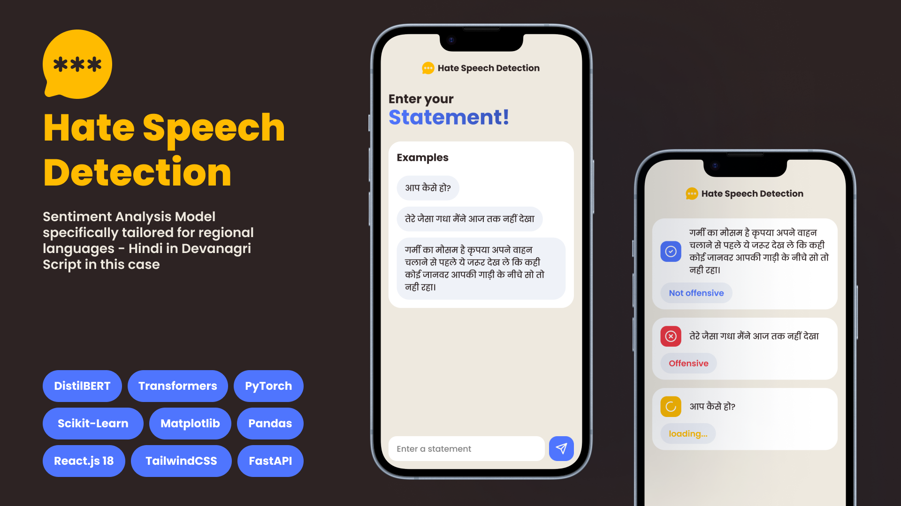

## Hate Speech Detection Model

This repo is to maintain the web app for the hate speech detection model. The model is trained on the HASOC dataset and is deployed using FastAPI. The model is trained using the pretrained distilBERT model and the training code is available in the `model` folder.

### 💬 Problem Statement
**A Natural Language Prediction Model** which will take written words (string) as input and classify it into the three categories, i.e. hate, neutral, supportive.

### 💻 Tech Stack
- Python
- Pandas
- Numpy
- Scikit-learn
- Matplotlib
- PyTorch
- Transformers
- DistilBERT
- FastAPI
- React

### 🧠 Model
- DistilBERT

### ⚙️ Working
- The model is trained on the HASOC dataset.
- The model is trained using the pretrained distilBERT model.
- The model is deployed using FastAPI.
- The web app is built using React.

### 📌 Setup
- Clone the repository.
- Install the required packages using `pip install -r requirements.txt`.
- Run the FastAPI server using `uvicorn main:app --reload`.
- Run the React app using `npm start`.

### 📚 References
- [Hate Speech Multilabel Classification with BERT](https://huggingface.co/wesleyacheng/hate-speech-multilabel-classification-with-bert)
- A Hate Speech MultiLabel Classifier to classify independent targets of race, religion, origin, gender, sexuality, age, disability by doing transfer learning on [BERT](https://huggingface.co/datasets/ucberkeley-dlab/measuring-hate-speech) with the [UC Berkeley D-Lab's Hate Speech Dataset](https://huggingface.co/datasets/ucberkeley-dlab/measuring-hate-speech) from the paper [The Measuring Hate Speech Corpus: Leveraging Rasch Measurement Theory for Data Perspectivism](https://aclanthology.org/2022.nlperspectives-1.11.pdf)
- [Hate Speech Detection from Code-mixed Hindi-English Tweets Using Deep Learning Models](https://arxiv.org/abs/1811.05145)
- [Comparison of Pretrained Embeddings to Identify Hate Speech in Indian Code-Mixed Text](https://ieeexplore.ieee.org/abstract/document/9362731)
- [Indonesia Hate Speech Detection Using Deep Learning + Acoustic](https://ieeexplore.ieee.org/abstract/document/8629154)
- [# Advances in Machine Learning Algorithms for Hate Speech Detection in Social Media: A Review + Cultural Drawback vala point isme hai](https://ieeexplore.ieee.org/abstract/document/9455353)